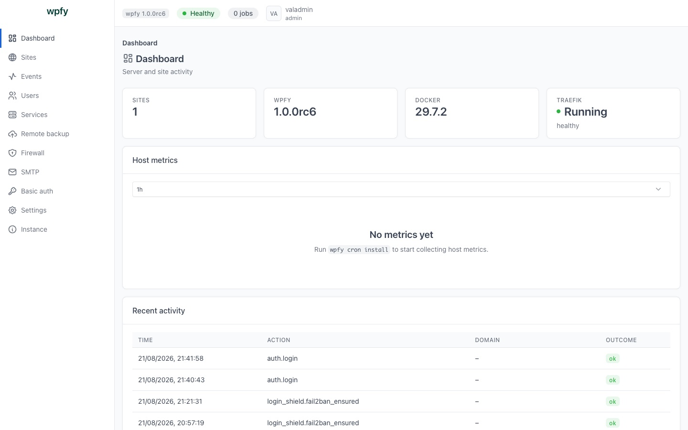
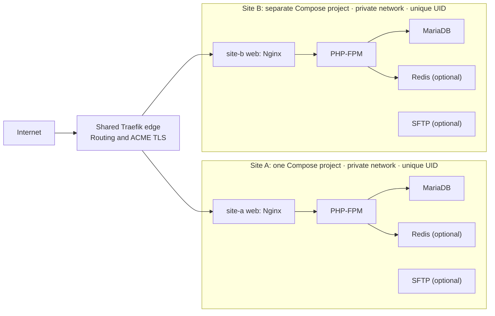

<p align="center">
  <strong>wpfy</strong><br>
  Docker-first WordPress VPS installer and server-management CLI
</p>

<p align="center">
  Build and operate WordPress sites as separate Docker Compose stacks on an Ubuntu VPS. wpfy keeps the edge proxy shared, while each managed site has its own runtime, files, database state, credentials, network boundary, and Unix identity.
</p>

<p align="center">
  <a href="https://github.com/wpfyorg/wpfy/releases/tag/v1.0.0-rc4"></a>
  <a href="https://github.com/wpfyorg/wpfy/blob/main/pyproject.toml"></a>
  <a href="https://github.com/wpfyorg/wpfy/blob/main/LICENSE"></a>
  <a href="https://docs.docker.com/compose/"></a>
</p>

<p align="center">
  <a href="#quick-start">Quick start</a> ·
  <a href="#how-it-works">Architecture</a> ·
  <a href="#safety-and-isolation">Safety model</a> ·
  <a href="ROADMAP.md">Roadmap</a> ·
  <a href="SECURITY.md">Security</a> ·
  <a href="CONTRIBUTING.md">Contributing</a>
</p>



> [!WARNING]
> **`v1.0.0-rc4` is a release candidate, not a production-readiness claim.** It passed local tests and public CI; the panel HTTP surface has been verified against a live server, and a certificate was issued end to end. Provider-S3, real-systemd, anonymous-image-pull, and external-scanner coverage remain unvalidated. Start on a fresh or disposable VPS, read the [safety model](#safety-and-isolation), and [report problems](https://github.com/wpfyorg/wpfy/issues/new/choose). See the [release notes](https://github.com/wpfyorg/wpfy/releases/tag/v1.0.0-rc4) and [roadmap](ROADMAP.md) for open release work.

## Why wpfy?

Traditional WordPress managers commonly install shared Nginx, PHP, and database services directly on the host. That makes version changes, cleanup, and failure boundaries host-wide concerns.

wpfy takes a Docker-first path. Each site runs in its own Docker Compose project, so its Nginx, PHP-FPM, MariaDB, optional Redis, files, credentials, and private network are managed together. A shared Traefik edge routes domains and manages TLS, while one CLI handles creation, SSL, backups, restores, diagnostics, SFTP, WordPress commands, and runtime control.

Built for developers and WordPress server administrators who operate their own Ubuntu VPS. It is not yet a fit for hosting mutually untrusted tenants.

## What you can do

| Area | What wpfy provides |
|---|---|
| Site lifecycle | Create WordPress or static sites, inspect them, update controlled settings, and remove them with confirmation. |
| Docker-first runtime | One Compose project per site, per-site PHP `7.4` through `8.4`, optional Redis, and targeted Compose controls. |
| TLS and DNS | Let’s Encrypt through Traefik, DNS/IP preflight before issuance, Cloudflare detection, and Cloudflare-DNS wildcard certificates. |
| Backups and recovery | Verified local archives, explicit restore, local retention/pruning, S3-compatible remote operations, edge backups, and a systemd backup schedule. |
| WordPress operations | WP-CLI, controlled PHP/config changes, cache clearing, cron runners, and SMTP configuration with explicit test sends. |
| Access and diagnostics | Per-site SFTP lifecycle, logs, security audits, health checks, diagnostics, and a browser panel that is loopback-only by default. |
| Host firewall | ufw port rules with presets and an SSH-lockout guard, plus fail2ban intrusion prevention whose bans reach container traffic. |

## Quick start

### Requirements

- A fresh Ubuntu VPS with sudo access. Ubuntu is the v1 target; other distributions are untested.
- Docker Engine and the Docker Compose plugin. The installer installs or verifies them.
- Python 3.10 or later.
- A domain whose DNS can point at the VPS before you enable TLS.
- Outbound access to GitHub, image registries, Let’s Encrypt, and public-IP services.

### Install the current release candidate

Review the installer, pin the immutable release tag, and let the installer verify the downloaded source archive with the checksum published for RC4:

```bash
curl -fsSLO https://raw.githubusercontent.com/wpfyorg/wpfy/v1.0.0-rc4/install.sh
less install.sh

sudo WPFY_REF=v1.0.0-rc4 \
  WPFY_SOURCE_SHA256=<paste the SHA-256 from the RC4 release page> \
  bash install.sh
```

Take the checksum from the [RC4 release](https://github.com/wpfyorg/wpfy/releases/tag/v1.0.0-rc4) — it is the official source-archive SHA-256 for that tag, and pasting one from an earlier release will correctly abort the install. The installer logs to `/var/log/wpfy/install.log`; `--dry-run`, `--verbose`, and `--no-color` are available when needed.

### Create, secure, and verify a site

```bash
# Pull required images and start the shared Traefik edge.
wpfy stack install --nginx --php --mysql

# Create and provision WordPress. `run` is the flat operator command.
wpfy run example.com --wp

# Request TLS only after DNS is ready. wpfy runs DNS/IP preflight first.
wpfy site ssl example.com --letsencrypt

# Confirm readiness and inspect the host.
wpfy site status example.com
wpfy debug
```

For a new site whose DNS is already correct, combine creation and TLS with `wpfy run example.com --wp -le`.

### Open the browser panel

The panel is loopback-only by default. On the VPS run `wpfy panel`; from your workstation, tunnel the port and open the URL it prints:

```bash
ssh -L 8642:127.0.0.1:8642 user@your-server
```

The access token can be supplied with `--token-file` or `WPFY_PANEL_TOKEN`; `--token` still works but exposes the value in the process table and warns.

**Accounts.** A first-run browser wizard creates the first administrator, then both setup routes close permanently. Accounts are named users with administrator and site-manager roles; a site-manager is scoped to its assigned sites and refused everything else, including the live event stream for sites it does not manage. TOTP enrolment is verified against a real code before it is persisted.

**Sites.** A three-step wizard creates a site, with a dry-run plan before anything is written and a background job reporting live steps. Site detail is five tabs — Overview, Settings, Data, Access, Automation — covering health and diagnostics, PHP/cache/vhost/security settings behind one preview-and-apply bar, databases and backups, SFTP, files and WP-CLI, and cron. Newly created or rotated credentials appear once in a one-time panel; deletion needs the exact domain typed and is refused if the pre-delete backup fails.

**Server.** Admin pages cover events, users, running services, remote backup destinations and schedule, the host firewall (ufw ports plus fail2ban intrusion prevention), mail transport, basic-auth inventory, settings, and instance facts. Long operations are jobs: a header popover tracks them across navigation, with a detail page per job. Recent events are also available from the CLI with `wpfy log events`.

**Publishing it.** `wpfy panel expose` asks for the domain and, when the host has no ACME contact yet, the Let's Encrypt address that decides whether a certificate can issue at all. It refuses without named-user authentication, at least one enrolled TOTP factor, a passing DNS/IP preflight, and the domain typed back exactly. Basic auth can be placed in front of the published router.

For a host with no domain, `wpfy panel expose --no-domain` publishes on the machine's public address over a self-signed certificate and prints its SHA-256 fingerprint to check against the browser warning, plus a single-use setup link. Start it with `wpfy panel --public`. That mode is a stopgap: the certificate chains to nothing, and it does not sit behind the edge proxy's rate limit.

The panel loads no script, style, font, or image from a third-party origin — its CSP is `default-src 'self'`, and everything it serves ships with it.

### Develop from source

```bash
git clone https://github.com/wpfyorg/wpfy.git
cd wpfy
PYTHONPATH=src python3 -m wpfy --help
```

## How it works



Traefik is the shared edge and routing network. The web container for each site joins that routing network; its database and optional Redis remain on that site’s private network. The persisted site definition renders the site’s Compose file and environment, making lifecycle changes reproducible and scoped to that project.

## Common workflows

### Inspect TLS before or after issuance

```bash
wpfy site ssl example.com --preflight-only
wpfy site ssl example.com --status
wpfy site ssl example.com --renew
```

The preflight checks DNS before a certificate request. For Cloudflare DNS wildcard certificates, use the documented Cloudflare DNS flow rather than treating wildcard support as a general TLS feature.

### Back up and explicitly restore

```bash
wpfy backup example.com
wpfy backup example.com --list
wpfy restore example.com --latest
```

Archives are verified after creation. Restore validates the archive and available disk space before stopping the runtime; `--latest` is deliberately explicit.

### Change PHP and run WP-CLI

```bash
wpfy config example.com --php 8.3
wpfy site status example.com
wpfy wp example.com plugin list
```

### Give and remove per-site SFTP access

```bash
wpfy sftp example.com --enable
wpfy sftp example.com --status
wpfy sftp example.com --disable
```

SFTP is disabled by default. Enabling it adds a site-scoped container and allocates a loopback-bound host port; generated credentials are shown once.

### Diagnose a problem

```bash
wpfy debug example.com
wpfy log show example.com --nginx -f
wpfy secure example.com
```

## Command reference

Flat commands are the primary operator surface where an exact equivalent exists. Grouped `site` and `stack` commands remain for operations that do not yet have a flat counterpart.

| Need | Command |
|---|---|
| Create a site | `wpfy run <domain> --wp` |
| Check a site | `wpfy site status <domain>` |
| Manage TLS | `wpfy site ssl <domain> --letsencrypt` |
| Back up or restore | `wpfy backup <domain>` · `wpfy restore <domain> --latest` |
| Run WordPress CLI | `wpfy wp <domain> <wp-cli args>` |
| Control runtime | `wpfy up|down|pull <domain>` |
| Inspect or edit config | `wpfy config <domain>` · `wpfy edit <domain>` |
| Diagnose or audit | `wpfy debug [domain]` · `wpfy secure <domain>` |
| Start panel | `wpfy panel` |

Run `wpfy <command> --help` for arguments and examples.

<details>
<summary>More operator surfaces</summary>

| Group | Commands |
|---|---|
| Site and runtime | `wpfy site list|info|show|update|delete`, `wpfy compose`, `wpfy exec`, `wpfy cp`, `wpfy refresh`, `wpfy healthcheck`, `wpfy motd` |
| Backups | `wpfy backup prune`, `wpfy backup storage`, `wpfy backup remote`, `wpfy backup edge`, `wpfy restore edge`, `wpfy backup schedule` |
| Operations | `wpfy sftp`, `wpfy clean`, `wpfy log`, `wpfy cron`, `wpfy smtp`, `wpfy dns cloudflare`, `wpfy utility`, `wpfy update`, `wpfy version` |
| Shared stack | `wpfy stack install|status|upgrade|remove|purge` |

Use `wpfy --help` to see the complete command tree. Commands that can delete sites, remove volumes, purge the shared stack, or remove remote backups require care and, where implemented, explicit confirmation or `--force`.

</details>

## Safety and isolation

wpfy’s model is designed to reduce accidental cross-site coupling, not to make security guarantees.

- **Per-site Compose projects:** each site has distinct containers, data, files, and database state.
- **Network boundaries:** database and optional Redis are private to the site; only the web container joins the shared Traefik routing network.
- **Unix identity:** wpfy allocates a unique site UID and applies it to site files.
- **Nginx hardening:** the web service uses `nginxinc/nginx-unprivileged` and generated Nginx configuration denies common sensitive paths.
- **Secret and backup handling:** site `.env` files are restricted, and local backup archives are written with mode `0600`.
- **Panel exposure:** ad-hoc `wpfy panel` stays loopback-only, and SSH tunnelling remains the recommended access path. The opt-in exposed service binds only the dedicated `wpfy-panel-edge` gateway address; wildcard, public, and off-network binds are refused there, so the panel is reached through Traefik with its TLS termination and rate limit. `--no-domain` is the one deliberate exception: it binds the host's public address directly over a self-signed certificate, which means no CA-issued chain and no edge rate limit, and it is a stopgap for hosts that have no domain yet.

Important limits:

- Docker-daemon access and Traefik’s Docker socket access are host-level trust boundaries. A Docker or host compromise defeats per-site isolation.
- wpfy has **not** had an independent security audit or penetration test.
- RC4’s release validation is incomplete; do not infer production readiness from local tests or CI alone.
- Hosting mutually untrusted tenants on a shared host is out of scope during beta.

Read [SECURITY.md](SECURITY.md) before production use or security testing.

## Backups and disaster recovery

wpfy creates a local archive containing the managed site configuration, application files, generated web/PHP configuration, and a database dump when the database is running. Creation verifies the archive before publishing it; restore validates archive members and disk space before live mutation, preserves the live database credentials, then restarts and imports the database.

Supported recovery operations include:

- Local archive listing, explicit `--latest` restore, and retention/pruning.
- Verified copies to a destination directory.
- S3-compatible upload, named storage profiles, remote list/restore/delete/prune, and one systemd backup timer.
- Traefik/ACME edge backup and forced edge restore.

Remote deletion and pruning are explicit operations. wpfy manages its own object keys; it does not configure your storage provider’s bucket lifecycle policy.

## Compatibility and requirements

| Item | Current position |
|---|---|
| Host OS | Ubuntu-first in v1. Other Linux distributions are untested. |
| Python | Python `>=3.10`; public CI currently exercises 3.10 and 3.12. |
| Container runtime | Docker Engine with the Docker Compose plugin is required. |
| Host architecture | No end-to-end host compatibility matrix is published. The PHP-image workflow builds `linux/amd64` and `linux/arm64` images. |
| Permissions | Installation and site management need root or sudo access. |
| TLS DNS | Public A/AAAA records must point at the VPS, or a Cloudflare-proxied record must be detected. |
| Wildcard TLS | Supported only through the Cloudflare DNS flow. |

## Known limitations

- This is beta software. Interfaces and behavior may change before a final v1.0.0 release.
- RC4’s panel HTTP surface has been verified against a live server and a certificate was issued end to end, but provider-S3, real-systemd, anonymous-image-pull, and external-scanner coverage remain unvalidated; see its [release notes](https://github.com/wpfyorg/wpfy/releases/tag/v1.0.0-rc4) for the remaining gates.
- `wpfy stack migrate` does not migrate host-installed WordPress stacks in v1.
- The MySQLTuner helper is skipped until a vetted pinned image exists.
- phpMyAdmin, Adminer, and Composer helpers are pull-only; they do not create a public dashboard.
- wpfy intentionally does not manage host-level firewall, SSH, fail2ban, Netdata, or similar host services.

See [ROADMAP.md](ROADMAP.md) for planned hardening and future work. Planned items are not current features.

## Documentation and support

- [Release notes](https://github.com/wpfyorg/wpfy/releases/tag/v1.0.0-rc4) for RC4 provenance, validation, and known deferred checks.
- [Roadmap](ROADMAP.md) for beta hardening and v2 candidates.
- [Security policy](SECURITY.md) for private vulnerability reporting and threat-model boundaries.
- [Bug report](https://github.com/wpfyorg/wpfy/issues/new?template=bug_report.md) for reproducible problems. Redact domains, IPs, tokens, passwords, and `.env` contents.
- [Feature request](https://github.com/wpfyorg/wpfy/issues/new?template=feature_request.md) for ideas not already covered by the roadmap.

## Contributing

Contributions and deployment feedback are welcome during beta. Read [CONTRIBUTING.md](CONTRIBUTING.md), keep changes focused, and run the relevant tests before opening a pull request:

```bash
pytest -q
```

Please use [private security reporting](SECURITY.md) instead of public issues for vulnerabilities.

## Security and license

Report vulnerabilities through [GitHub Security Advisories](https://github.com/wpfyorg/wpfy/security/advisories/new), not a public issue. wpfy is licensed under the [GNU Affero General Public License v3.0 only](LICENSE).
